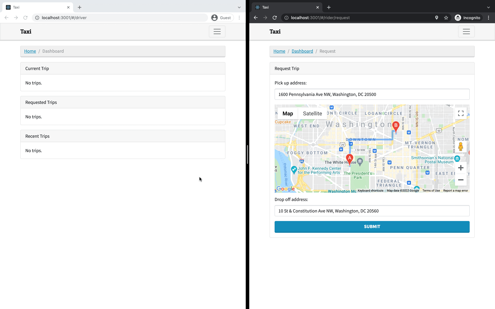

# Text-summarisation-microservice

## Introduction

This a ride-sharing app with Django Channels, React, and Docker. The app manages client/server communication with Django Channels and WebSockets, uses a front-end React app, includes a RESTful API with Django REST Framework, and tests the app using the Cypress testing framework.


# Pre-requisites

I am assuming you, the reader have the following installed:

- [Python](https://www.python.org/) 3.9 or higher. (This app was developed using python 3.9)
- [Docker](https://docs.docker.com/engine/install/)

If not, don't panic, just click on those links and install them for your particular operating system.

### Note

When i put this app together i used `ubuntu wsl`. It should work just fine on linux/mac os environments.

# Running the app



You will need a valid api key. Use google to discover how to create one. Once you have one paste it into line `50` of the [docker-compose](docker-compose.yml).

```
    - REACT_APP_GOOGLE_MAPS_KEY=api_key
```

`Make up` will bring the app up.

`Make down` will bring the app down.

`Make clean` will remove the containers.

## Testing

I prefer to write tests before the code. I have taken the approach of testing through cypress integration testing.